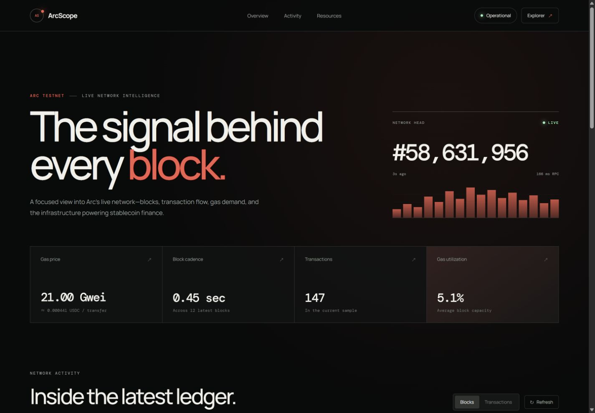
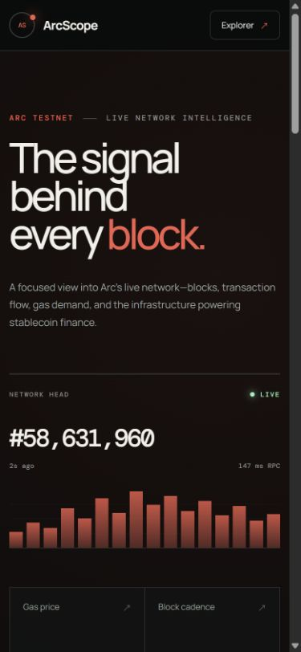

# ArcScope

**Live intelligence for Arc Testnet.**

**Live dashboard:** [arcscope.vercel.app](https://arcscope.vercel.app/)

ArcScope is an independent, community-built network analytics dashboard that turns live Arc Testnet JSON-RPC data into a clear, responsive view of blocks, transaction activity, gas demand, and network health.

It was created by a **designer exploring AI-assisted development and Web3**—a practical experiment in using design experience and vibe coding to turn an idea into a functioning onchain product. ArcScope is not affiliated with or endorsed by Circle.

## Why ArcScope exists

Block explorers are powerful, but they can be dense when you only want to understand the pulse of a network. ArcScope focuses on the highest-signal network information and presents it as a polished analytics workspace suitable for both quick checks and deeper exploration.

There is no mock network data. Every block, transaction, fee, and activity value shown in the dashboard comes from Arc Testnet at request time.

## Features

- Live network status, latest block, Chain ID, and RPC latency
- Current gas price and estimated simple-transfer cost in USDC
- Sampled block cadence, transaction volume, and gas utilization
- Twelve recent blocks with capacity, size, hash, and relative age
- Block detail drawer with timestamp, hashes, fee recipient, gas, and base fee
- Recent transaction feed with transfer/contract-call classification
- Transaction activity visualization by block
- Direct links to matching blocks and transactions on Arc Explorer
- Verified links to the Arc Explorer, Faucet, documentation, and node repository
- Automatic 15-second refresh plus explicit refreshing feedback
- Loading skeletons, preserved stale data, RPC error recovery, and empty states
- Keyboard-accessible detail drawer and reduced-motion support
- Responsive layouts for desktop, tablet, and mobile

## Live Arc Testnet data

The Next.js server route proxies read-only JSON-RPC calls to Arc's official public endpoint. Keeping the RPC call server-side provides one consistent data contract to the UI and allows the endpoint to be replaced through an environment variable without changing client code.

Methods currently used:

- `eth_chainId`
- `eth_blockNumber`
- `eth_gasPrice`
- `eth_getBlockByNumber` with full transaction objects

Default network configuration:

| Field | Value |
| --- | --- |
| Network | Arc Testnet |
| Chain ID | `5042002` (`0x4CEF52`) |
| RPC | `https://rpc.testnet.arc.io` |
| Explorer | `https://testnet.arcscan.app` |
| Native gas asset | USDC |

## Tech stack

- Next.js 16 (App Router)
- React 19
- TypeScript
- Arc Testnet JSON-RPC
- Purpose-built responsive CSS (no UI template or component kit)
- Vercel-compatible server route

## Run locally

Requirements: Node.js 20.9 or later and npm.

```bash
git clone <your-repository-url>
cd arcscope
npm install
cp .env.example .env.local
npm run dev
```

Open [http://localhost:3000](http://localhost:3000).

The environment file is optional because the official public RPC is the default. For production, set `NEXT_PUBLIC_SITE_URL` to the final canonical URL so social preview metadata uses the correct origin.

## Validate a production build

```bash
npm run lint
npm run build
npm run start
```

## Project structure

```text
arcscope/
├── app/
│   ├── api/rpc/route.ts   # Typed Arc JSON-RPC aggregation and error boundary
│   ├── globals.css        # Design system, data UI, interactions, responsive states
│   ├── layout.tsx         # Metadata and social sharing configuration
│   └── page.tsx           # Dashboard, activity views, and block details
├── public/
│   └── og.png             # ArcScope social preview
├── .env.example
└── package.json
```

## Deploy to Vercel

1. Push the project to a GitHub repository.
2. Import the repository in Vercel.
3. Keep the detected Next.js defaults.
4. Add `NEXT_PUBLIC_SITE_URL` with the production URL after the first deployment.
5. Optionally add `ARC_RPC_URL` if using another Arc-compatible RPC provider.
6. Redeploy and verify `/api/rpc` and the dashboard.

No database, wallet key, or secret is required. Never commit private keys or wallet credentials.

## Official Arc resources

- [Arc documentation](https://docs.arc.io)
- [Connect to Arc](https://docs.arc.io/arc/references/connect-to-arc)
- [Gas and fees](https://docs.arc.io/arc/references/gas-and-fees)
- [Arc Testnet Explorer](https://testnet.arcscan.app)
- [Circle Faucet](https://faucet.circle.com)
- [Arc Node repository](https://github.com/circlefin/arc-node)

## Screenshots

Add final deployment captures here before sharing the repository:

```md


```

## License

[MIT](./LICENSE)
